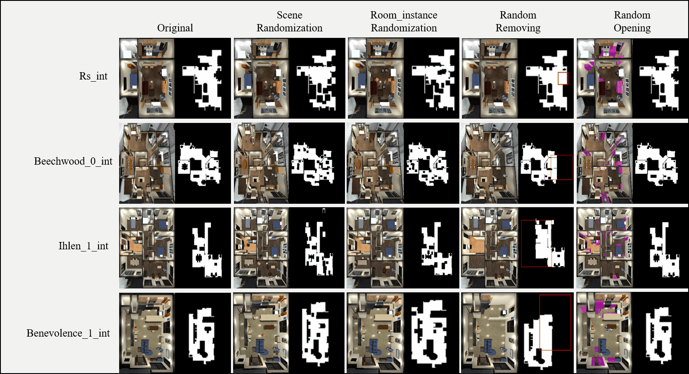

# Scene-Augmentation-Methods-for-Interactive-Embodied-AI-Tasks
Code and additional information for our paper entitled 'Scene Augmentation Methods for Interactive Embodied AI Tasks'

### Requirements:
> python 3.8
> igibson 2.2.0

### Demo
'python example.py'
